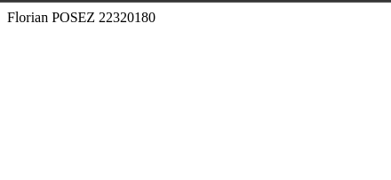

# docker-image-creation
Le programme est un petit script python utilisant flask pour afficher mon nom, mon prénom ainsi que mon numéro d'étudiant.
Capture d'écran de `docker run -it python-docker-dev`:
 

Capture d'écran de `kubectl get all` pour obtenir les pods et les services:
 

